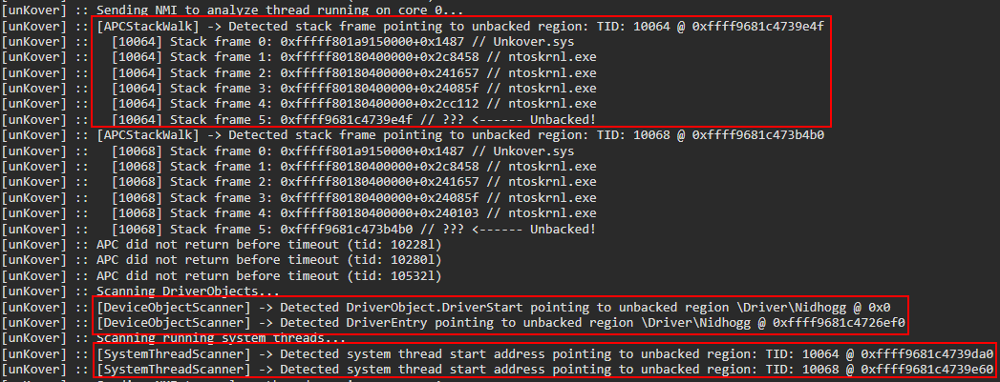

# unKover

*UPDATE: unKover has since been integrated in my EDR [NIGHTWATCH](https://github.com/eversinc33/NIGHTWATCH) and all development will continue there*

Windows anti-rootkit driver that can detect drivers mapped to kernel memory. Think [Moneta](https://github.com/forrest-orr/moneta), but for the kernel (obviously this is a simplified comparison). Additionally detects hidden threads as of the latest version.

The idea is to have a small & concise anti-rootkit to aid you (the rootkit dev) in honing your rootkits evasion abilities while also showcasing detection vectors with minimal FP rate that can detect many of the openly available driver mapper + rootkit combinations. 

For more information see the following blogposts:
* https://eversinc33.com/posts/anti-anti-rootkit-part-i.html
* https://eversinc33.com/posts/anti-anti-rootkit-part-ii.html

While some open source anti-cheats with capabilities far beyond this tool's exist (such as donnaskiez [ac](https://github.com/donnaskiez/ac)), I wanted something that I can easily tweak according to my needs. Maybe it will be useful for you too.

Techniques implemented:

* NMI Callbacks: Periodically sends Non-Maskable Interrupts (NMIs) to each core and analyzes the currently running thread's call stack for any pointers to unbacked memory.
* APC StackWalks: Same as the NMI check, but with an APC queued to each system thread.
* System thread analysis: Periodically check all system threads for start-addresses pointing to unbacked memory.
* Driver Object analysis: Periodically check all driver objects registered on the system, and check if their DriverEntry points to unbacked memory.
* .text section comparison: Periodically check drivers for .text section thats differ in-mem vs on-disk, to detect driver "stomping"
* detecting threads removed from the `PspCidTable`

<p align="center">

</p>

## Installation

You need to enable testsigning to load the driver. I also recommend to enable debugging for the kernel.

Run the following from an administrative prompt and reboot afterwards:

```cmd
bcdedit /set testsigning on
bcdedit /debug on
```

Then you can load the driver with `sc.exe` or use OSR DriverLoader:

```cmd
sc.exe create Unkover binPath= "C:\path\to\Unkover.sys" type= kernel start= demand
sc.exe start Unkover
```

Afterwards, output will appear in the debug logs (view with e.g. WinDbg or DebugView)

### Credits

* DeviceObject scanning code partly taken from https://github.com/not-wlan/driver-hijack
